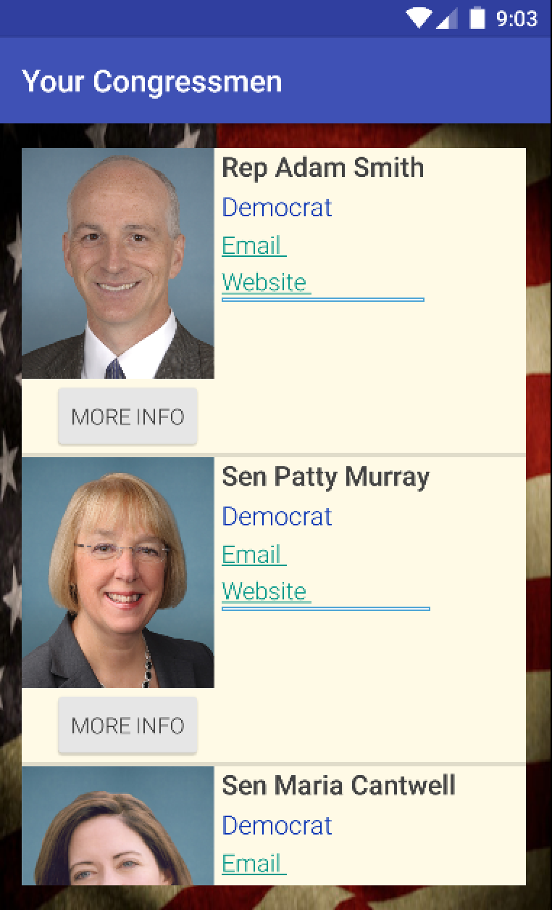

# PROG 02: Represent!

This is an app to help people learn about their representatives in Congress! The user can see information about their representatives of their current location or of any location they choose. They can email them, visit their website, and learn about what they're doing in Congress by reading about their sponsored bills and committees.

## Authors

Stephanie Lin ([stlin@berkeley.edu](mailto:stlin@berkeley.edu))

## Demo Video

See [the app in action!] (https://youtu.be/Nl5ZXa0hIUg)

## Screenshots

## Acknowledgments

Shout out to Google and Stack Overflow for making this possible, and of course the CS 160 staff. 
The code for the ShakeListener was taken from [this post] (http://stackoverflow.com/questions/2317428/android-i-want-to-shake-it)
